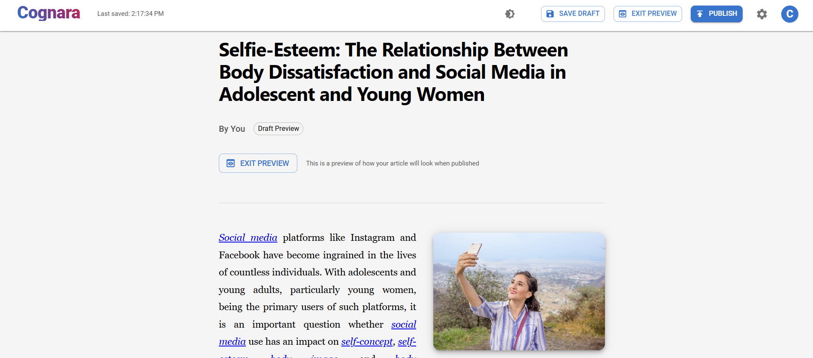
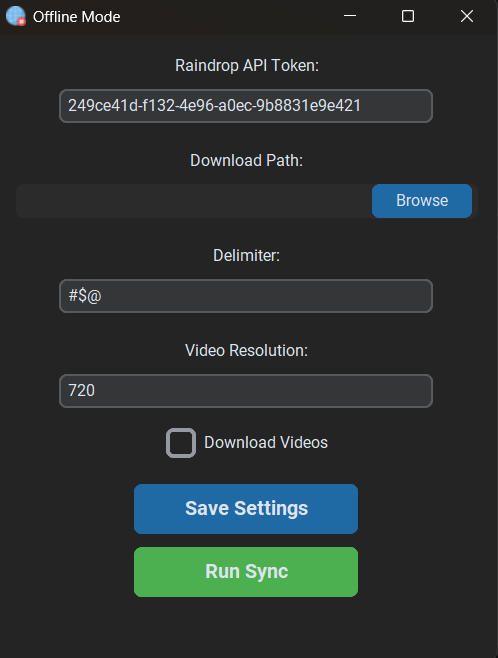

#  Hey, I'm Mina Boktor

<div align="center">
  
[](https://git.io/typing-svg)

</div>

---

## 🚀 About Me

<div style="display: flex; align-items: flex-start; gap: 20px;">
<div style="flex: 1;">

I'm a passionate software engineer with a deep interest in **cybersecurity**, **cryptography**, and **full-stack development**. I love building secure, efficient solutions and exploring the intersection of security and software engineering.

- 🔐 **Security First**: Implementing robust cryptographic solutions
- 🌐 **Full-Stack Developer**: Building end-to-end web applications with modern frameworks
- 💻 **Multi-Language**: Proficient in C#, Python, JavaScript, and modern web technologies  
- 🛠️ **Problem Solver**: Turning complex challenges into elegant solutions
- 📚 **Continuous Learner**: Always exploring new technologies and methodologies
- 🎯 **Focus Areas**: Cryptography, Web Security, Full-Stack Development, Software Architecture

</div>
<div style="flex: 0 0 350px;">

</div>
</div>

---

## 🛠️ Tech Stack

<div align="center">

<table>
<tr>
<td align="center" width="50%">

### 🔤 Languages
<p>


</p>
<p>


</p>
<p>


</p>

</td>
<td align="center" width="50%">

### ⚡ Frameworks & Tools
<p>


</p>
<p>


</p>
<p>


</p>

</td>
</tr>
<tr>
<td align="center" colspan="2">

### 🛡️ Security & DevOps
<p>


</p>

</td>
</tr>
</table>

</div>

---

## 🏆 Featured Projects

### 🧠 Cognara - Full-Stack Blog Platform
[](https://github.com/MinaBoktor/Cognara)

<div align="center">

</div>

A comprehensive blog platform enabling open article submissions with robust administrative moderation. Features modern SPA architecture, SEO optimization, and automated newsletter functionality.

**🎯 Key Features:**
- Open article submission system with intuitive frontend interface
- Secure admin moderation dashboard with approval workflow
- SEO-friendly URLs and comprehensive metadata optimization
- Automated email notifications and newsletter integration system
- Fully responsive design with modern UI/UX principles

**💻 Tech Stack:** `React.js` `Django` `PostgreSQL` `Tailwind CSS` `Django REST Framework` `SMTP Integration`

---

### 📈 Apex Equity - Financial Analytics Platform
[](https://github.com/MinaBoktor/Apex-Equity)

<div align="center">

</div>

A sophisticated financial analytics and equity management platform designed for investment tracking and portfolio optimization with real-time data integration and advanced analytics capabilities.

**🎯 Key Features:**
- Real-time financial data processing and visualization
- Advanced portfolio analytics and performance tracking
- Interactive charts and financial metrics dashboard
- Secure data handling with encryption protocols
- Comprehensive reporting and export functionality

**💻 Tech Stack:** `Python` `Financial APIs` `Data Analytics` `Visualization Libraries` `Security Framework`

---

### 🔐 RSA-secureX - Advanced Cryptographic System
[](https://github.com/MinaBoktor/RSA-secureX)


A sophisticated implementation of the RSA public-key cryptosystem featuring extended precision arithmetic for handling massive integers (hundreds of digits). Built with security-first principles and optimized performance.

**🎯 Key Features:**
- Extended precision arithmetic for large-scale cryptographic operations
- Secure key generation and management with entropy optimization
- Optimized encryption/decryption algorithms with performance monitoring
- Comprehensive testing suite with security validation
- Cross-platform compatibility with robust error handling

**💻 Tech Stack:** `C#` `Cryptography` `Big Integer Mathematics` `Security Protocols` `Performance Optimization`

---

### 🌐 Offline-mode - Smart Bookmark Manager
[](https://github.com/MinaBoktor/Offline-mode)

<div align="center">

</div>

Intelligent offline bookmark management solution that creates local copies of Raindrop.io bookmarks, ensuring accessibility even without internet connectivity through smart synchronization.

**🎯 Key Features:**
- Seamless Raindrop.io integration with OAuth authentication
- Offline-first architecture with intelligent caching
- Smart synchronization with conflict resolution
- Cross-platform compatibility and user-friendly interface
- Automated backup and restore functionality

**💻 Tech Stack:** `Python` `API Integration` `Data Management` `Automation` `OAuth Security`

---

## 📊 GitHub Analytics

<div align="center">


</div>

<div align="center">

[](https://git.io/streak-stats)

</div>

---

## 🤝 Let's Connect & Collaborate

<div align="center">

<div style="background: linear-gradient(135deg, #667eea 0%, #764ba2 100%); padding: 30px; border-radius: 15px; margin: 20px 0;">

### 🌟 Ready to Build Something Amazing Together?

<p style="font-size: 18px; margin: 20px 0; color: white;">
I'm always excited to connect with fellow developers, discuss innovative projects, or explore collaboration opportunities!
</p>

<div style="display: flex; justify-content: center; gap: 15px; flex-wrap: wrap; margin-top: 25px;">

[](https://www.linkedin.com/in/minaboktor1/)
[](mailto:mina.maged.pe@gmail.com)
[](https://minaboktor.dev)
[](https://x.com/Mina__Boktor)

</div>

</div>

</div>

---

<div align="left">

### 💻 Code Philosophy

```javascript
const developer = {
  name: "Mina Boktor",
  motto: "Clean code always looks like it was written by someone who cares",
  principles: [
    "Security by design, not as an afterthought",
    "Elegant solutions over quick fixes", 
    "Continuous learning drives innovation",
    "Code quality reflects professional integrity"
  ],
  currentFocus: () => {
    return "Building secure, scalable applications that make a difference";
  }
};

console.log(`${developer.name}: ${developer.currentFocus()}`);
// Output: Mina Boktor: Building secure, scalable applications that make a difference
```


**Thanks for exploring my work! Let's connect and create something extraordinary together.**

</div>

---

<div align="center">

</div>
